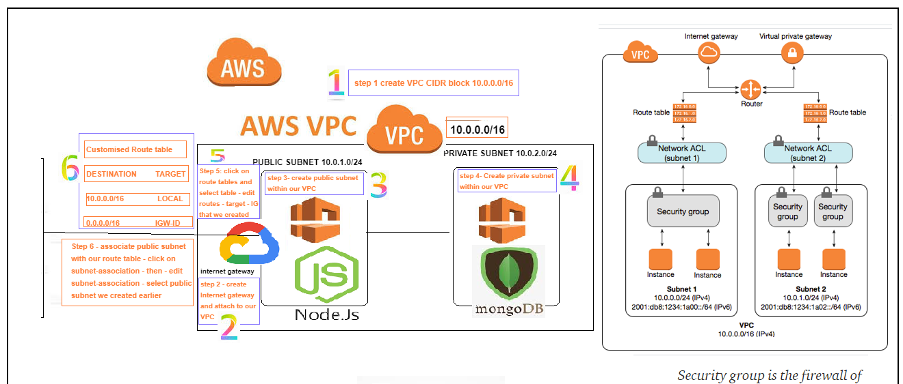
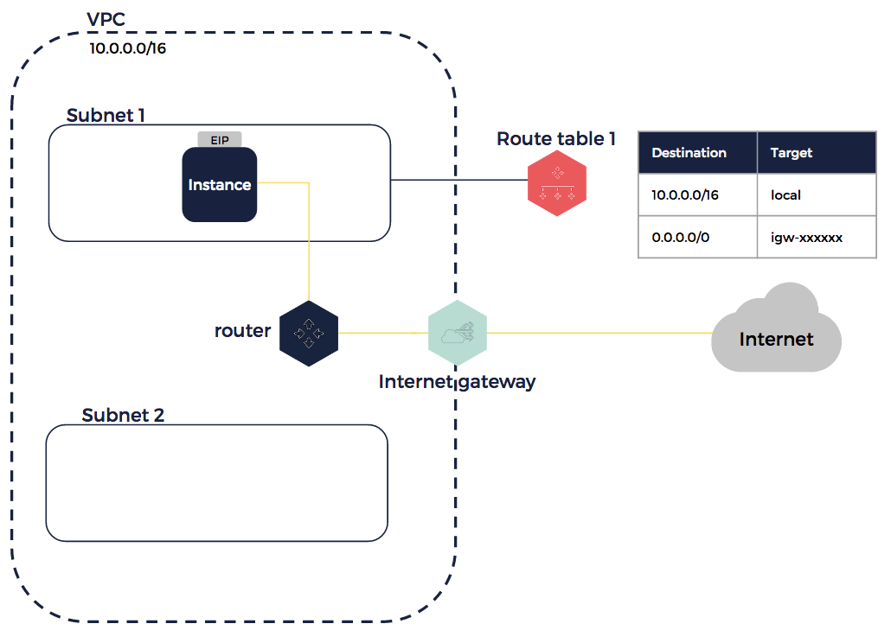
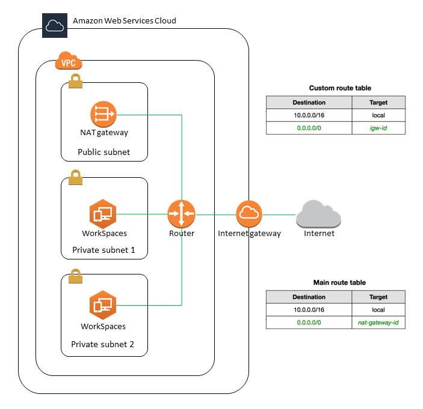
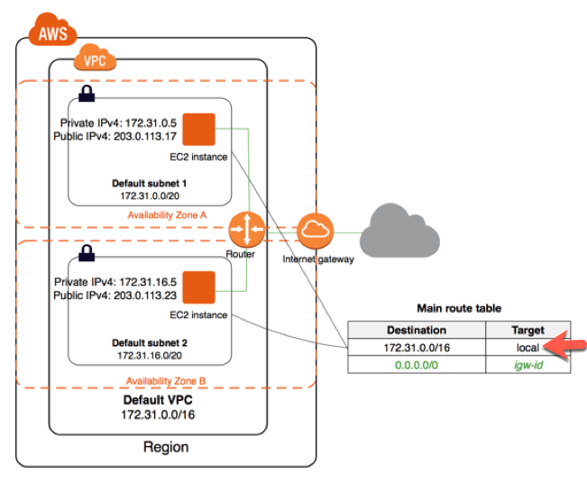
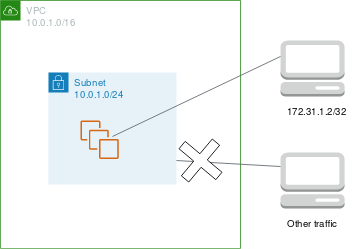
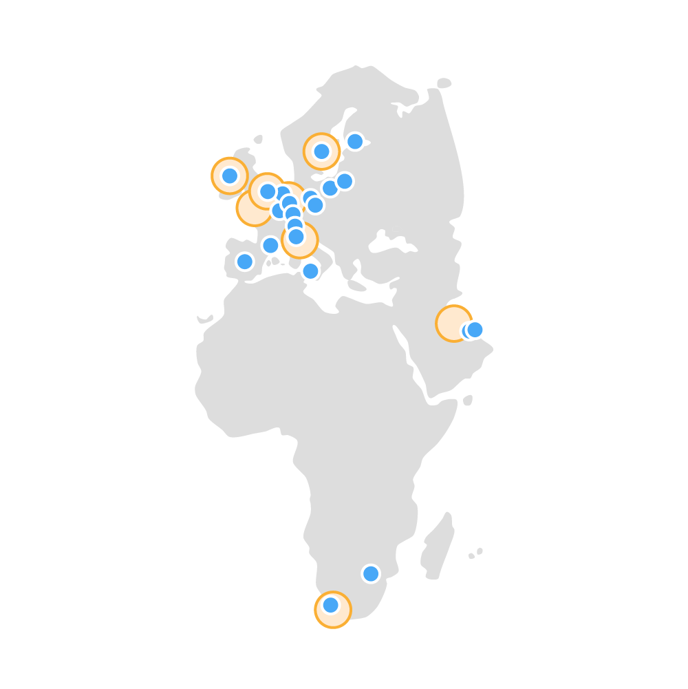

# AWS Virtual Private Cloud (VPC)

## What is a VPC?
- AWS isolated virtual network - it allows us to control virtual network environment including selections of your own IPs address range, we can create multiple subnets within one VPC with specific network configuration. We can use both IPV4 and IPV6 for most resources, It provides security for your services or instances.

## Internet Gateway (IG)
- A horizontally scaled, redundant and highly available VPC component that allows the communication between the VPC and the internet which serves two purposes:
  - Provide a target in your VPC route tables for internet-routable traffic
  - Perform Network Address Translation for instances that have been assigned public IPV4 addresses.

## Subnets
- A logical subdivision of an IP network, This enables us to split the network into both public and private networks which allows for more efficiency. The smaller interconnected networks are used to help minimise traffic and also navigate traffic security.

## Route Tables (RT)
- Each VPC has an implicit router, and you use route tables to control where the network traffic is directed. Each subnet must also be associated with a route table, this can be seperate from the main route table. If not specified the network will default to the main route table. Each table contains a set of rules, called routes which are used to determine where the network traffic of the subnets or gateway is directed

## Network Access Control List (NACLs)
- Stateless, Controls the traffic to or from a subnet according to a set of inbound and outbound rules which we have to explicitly. This is representing network level security at the subnet level. For example an inbound rule might deny incoming traffic from a range of IP addresses, while an outbound rule might allow all traffic to leave the subnet.

## Security Groups
- A security group acts as a virtual firewall for your instances to control the incoming and outgoing traffic. When launching an instance you can specify the security group it belongs to. The aim is to create a secure network with full control over who is able to access the instances.

## AWS Regions and Availablity Zones
- Regions
    - Each region is designed to be isolated from the other amazon regions, this achieves the greatest possible fault tolerance and stability. When viewing resources you are only able to see the resources that are tied to the specified region as they are not automatically replicated across regions.
- Availablity Zones
    - an availability zone is one or more discrete data centres with redundant power, networking and connectivity in a AWS region. This gives uses the ability to operate production applications and databases that are more highly available, fault tolerant and scaleable.

 - Edge Locations
 - Regions

## Creating a Custom VPC with a Private and Public Subnet
### Overview
- Create a VPC with an IPV valid CIDR block
  - `10.0.0.0/16` - kieron - `10.105.1.0/16`
- Create Internet Gateway (IG)
  - Attach the IG to our VPC - Each IG is a seperate resource that attaches to the VPC
- Create our route tables
  - Edit route and insert the IG in `target`
- Create Public Subnet
  - `10.105.0.0/24`
  - Associate Public Subnet with our RT
- Create Public NACLs
  - Set the inbound and outbound rules for the subnet `port:80`, `port:3000`, `port:22` 
- Create a Security Group for the app

### Create the VPC
- Search `VPC` in the dashboard
	- Select launch VPC with Single Public Subnet
	- Name the VPC
	- Public subnet IPv4 CIDR `10.105.1.0/24`
	- Launch the VPC

### Create the Internet Gateway (IG)
- Search `Internet Gateway` in the dashboard
	- Navigate to Internet Gateway 
	- Follow the naming convention `SRE_kieron_IG`
	- Attach IG to your created VPC `Actions > Attach to VPC` in this case if selected public VPC it will auto assign the Internet Gateway

### Subnet Creation
- Search `subnets` in the dashboard
	- Click `create subnet`
	- From the drop down select your VPC `vpc-0000000(SRE_kieron_vpc)`
	- Name the subnet using the nameing convention `SRE_kieron_xxx_subnet`
	- Enter a IPV4 CIDR block which should be in the range set for the VPC so for me its `10.105.1.0/24` for the new subnet
	- For each new subnet change the IPV4 to be in range so private `10.105.2.0/24`

### Creating Route Table (RT)
- Search `Route Tables` in the dashboard
	- Click `Create Route Table`
	- Name the route table using the naming convention `SRE_kieron_RT` this may have already been completed automatically for you
	- Select your VPC from the dropdown `vpc-0000000(SRE_kieron_vpc)`
	- Go to `Routes` tab and `Edit Routes`
	- Add the route with destination `0.0.0.0/0` and select `Internet Gateway` followed by your personal IG `SRE_kieron_IG`

### Create Network Access Control List (NACLs)
- Search `Network ACLs` in the dashboard
	- Click `Create Network ACL`
	- For this task we created two NACLs on Public and one Private
	- Follow the naming convention for both of these NACLs `SRE_kieron_priv_NACL` and `SRE_kieron_pub_NACL`
	- Select your vpc from the dropdown menu `vpc-0000000(SRE_kieron_vpc)`
	- Once created we now have to change the `Inbound rules` and `Outbound rules` these are different for the Public and Private subnets 

### Public Subnet Rules
#### Inbound
#### Outbound

### Private Subnet Rules
#### Inbound
#### Outbound

### Now these are created Launch the EC2 Instances
- Navigate to AMI
- Launch your AMI on your own VPC `vpc-0000000(SRE_kieron_vpc)`

