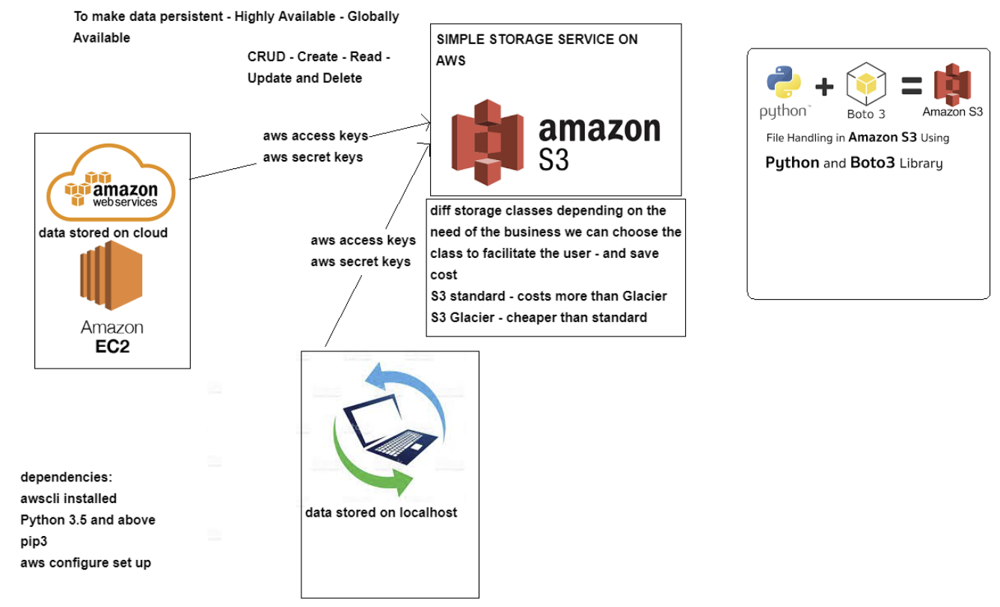

# S3 Storage Service

## Why use a S3 Bucket
We need Create, Read, Update and Delete functionality for the S3 Bucket.

The reason for creating and using a S3 bucket:
 - Highly Available
 - Available Globally
 - Cost effective data storage
    - S3 Standard - Offers high durability, availablilty and performance object storage for frequently accessed data. Low latency and high throughput means its appropriate for a variety of use cases such as cloud applications, dynamic websites and  gaming applications
    - S3 Glacier - An extremely low-cost storage service which provides secure, durable and flexible storage for data backup and archival main uses for the S3 Glacier is to offload data which is not accessed often, enabling customers to focus elsewhere rather than the maintaining their storage.
 - Flexibility
    - You are able to store every type of file 
 - Data Persistancy

## Accessing AWS S3
Prerequisites for accessing:
- AWSCLI installed
- Python 3.5+
  - sudo apt-get install python
  - sudo apt-get install python3-pip
  - alias python=python3
  - python3 -m pip install awscli
- AWS configure set-up
    - aws configure
    - AWS secret keys
    - aws s3 ls

## CRUD with S3
- Create - `aws s3 mb s3://srekieron`
- Read - `aws s3 cp s3://srekieron/README.md . `
    - `aws s3 sync . s3://srekieron/
- Update - `aws s3 cp README.md s3://srekieron`
- Delete - Remove empty bucket `aws s3 rb s3://srekieron`
    - Remove Object `aws s3 rm s3://srekieron/README.md`

# Using Python-Boto3 to Create a Bucket
## Authentication for S3
```
s3 = boto3.resource(
    service_name='s3',
    region_name='eu-west-1',
    aws_access_key_id='mykey',
    aws_secret_access_key='mysecretkey'
)
```

## Creating a Bucket on S3
```
s3 = boto3.client("s3")
s3.create_bucket(Bucket="srekieron")
```
## Uploading files to S3
```
# Upload files to S3 bucket
s3.Bucket('srekieron').upload_file(Filename='README.md', Key='README.md')
```

## Downloading File from S3
```
# Download file
s3.Bucket('srekieron').download_file(Key='README.md', Filename='README.md')
```

## Deleting file from S3 Bucket
```
s3 = boto3.resource("s3")
s3.Object("srekieron", "README.md").delete()
```
## Deleting a Bucket from S3
```
s3 = boto3.resource('s3')
bucket = s3.Bucket('srekieron')
bucket.delete()
```
